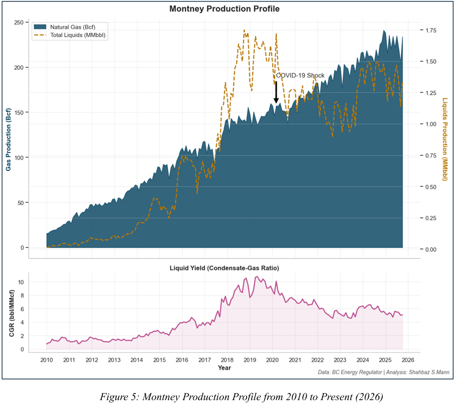
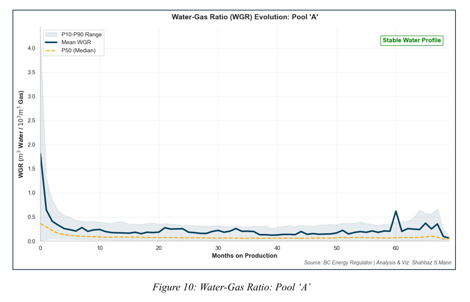
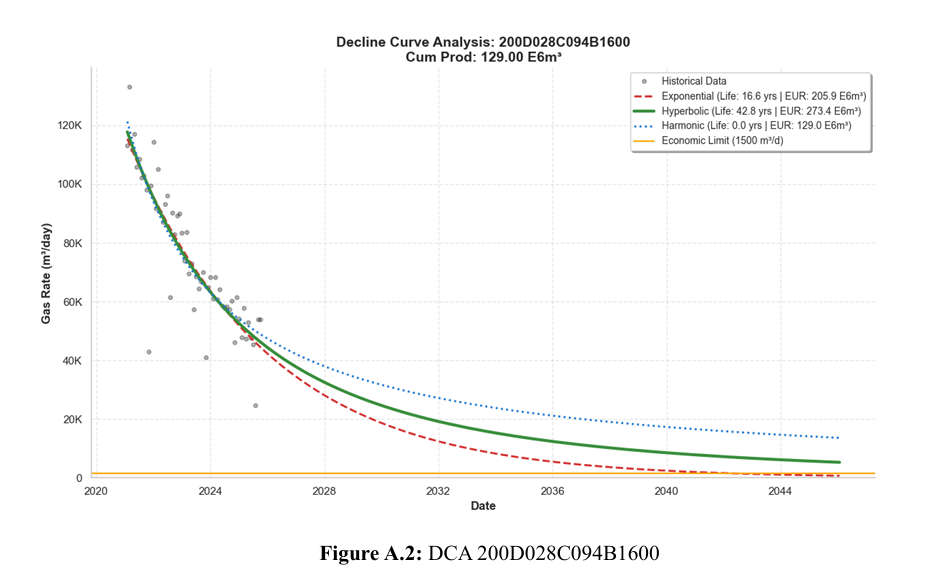

# BC Production Analytics

Analysis and visualization of British Columbia oil and gas production data, focusing on the Montney formation.



## What's This?

This notebook analyzes BC production data with 12 different visualizations: decline curves, type curves, probability plots, P90/P50/P10 forecasts, top well rankings, formation/pool comparisons, activity trends, economic analysis, water-gas ratios, plateau diagnostics, and spatial grid maps.

Data from BC Energy Regulator. Analysis by Shahbaz S Mann.



## Setup

You'll need Python 3.8+ and these libraries:

```bash
pip install pandas numpy matplotlib seaborn scipy
```

Then open the notebook:

```bash
jupyter notebook reports/BCPROD/report.ipynb
```



## What's Inside

The notebook does decline curve analysis with Monte Carlo simulation for probabilistic forecasts, calculates NPV and payout periods, generates type curves for different well vintages, and maps spatial well performance.

Economic assumptions used: $3/GJ gas price, $450/day OPEX, $5M drilling + $3.5M completion costs, 10% discount rate, 1000 m³/day economic limit.

## License

MIT License
